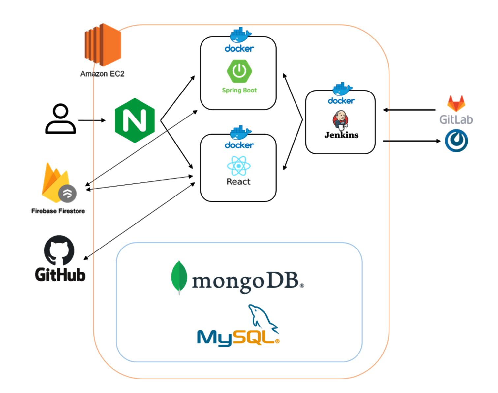
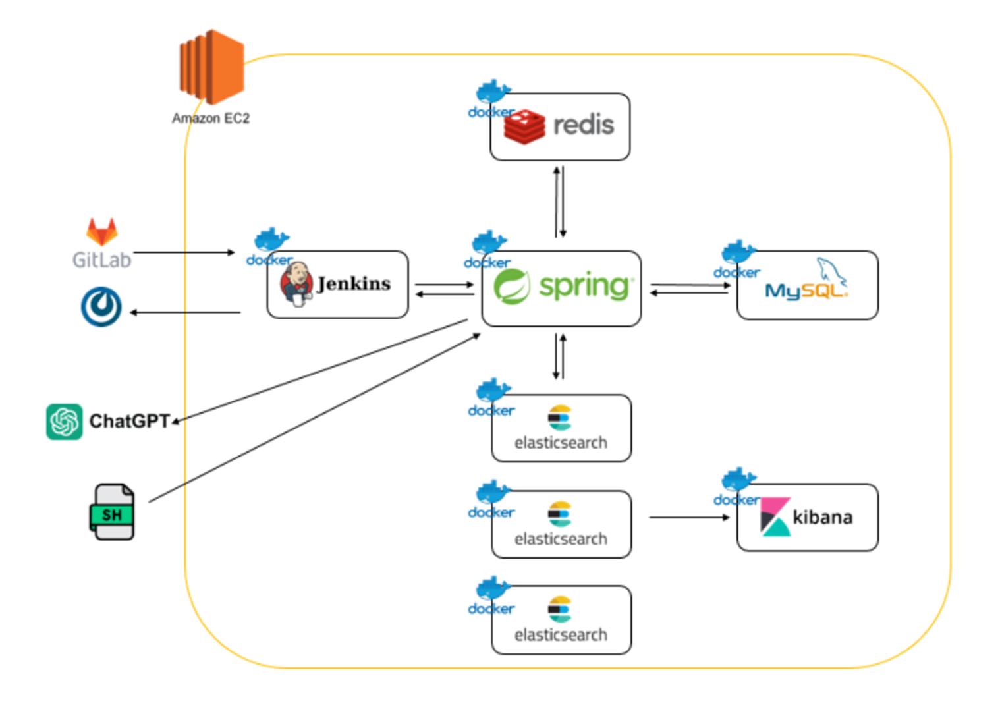

# 학생 개발자를 위한 협업 툴 : dddev
학생 개발자들의 협업 툴,
협업에 필요한 모든 것을 하나의 툴로 담아낸 프로젝트.
  
## 개요
개발자가 프로젝트 진행에 최소 2~3개의 협업 툴을 필요로 하는 시대, 초보 개발자 들도 프로젝트에 바로 활용할 수 있는 올인원 협업 툴 개발을 목표로 하였다.
  
## 메인 기능
- 문서 기반 : 모든 협업 문서는 트리 구조로 되어 부모와 자식이 존재하며 자식은 부모 속성에 의해 정렬되고 그 역할이 정의 된다. 사용자는 원하는 형태로 문서 카테고리 및 환경을 구성할 수 있다.

- 실시간 협업 문서 작성 : 웹 소켓을 활용한 실시간 협업 기능을 통해 모든 사용자가 동시에 하나의 문서를 작성할 수 있다.

- 서버 로그 분석 : 서버에서 전송된 로그를 시계열 데이터로 저장, 엘라스틱 서치를 활용하여 사용자가 원하는 형태로 볼 수 있다. GPT를 활용하여 로그의 원인 및 해결방안을 솔루션으로 받아볼 수 있다.

- 실시간 알림 : Firestore와 GitHubAPI를 통해 사용자가 소속된 리포지터리의 이벤트 (커밋, 리퀘스트 등) 알림을 받아볼 수 있으며 특정 키워드를 구독할 수 있다.

- GitHub 연동 : GitHub 계정으로 로그인, GitHub 리포지터리의 정보를 연동시키며 이를 활용해 프로젝트 협업 공간을 생성한다.
  

## 기술스택

상태 관리 : Redux

기능 구현 및 API 객체 구현

Javascript, React

실시간 문서 협업 : WebSocket, Quill

포맷팅 : ESLint, Prettier
  

## 기여
- 프로젝트 기획 : 프로젝트의 컨셉부터 세부 기능에 이르기 까지 모든 기능에 직접 기획 및 참여 하였습니다. 아이디어가 팀원들의 마음에 들어 본인의 기획이 원하는 모습으로 실제 구현되는 모습을 볼 수 있어 좋은 경험이 되었습니다.

- 프론트엔드 : 6인 팀에서 1인 프론트엔드를 맡아. 웹 클라이언트의 기반 부터 시작하여 각 기능의 구현 과 API 객체 관리, UX/UI 디자인 및 작성 까지 프론트엔드 전반에 기여 하였습니다.

- 대쉬보드 : 번다운 차트, 이슈 평균 소비 시간등의 프로젝트 분석 그래프와 최신 요청등의 정보를 한눈에 확인할 수 있는 대쉬보드를 구현.

- 실시간 문서 협업 : 웹 소켓 서버와 Quill 에디터를 활용하여 실시간 문서 협업 기능을 구현. 기존 웹 소켓 서버와 Quill에서 지원하지 않는 실시간 멤버 확인 기능, 사용자 영역 잠금 기능, 실시간 작성자 위치 태그, DB 연동 등의 기능을 추가 구현 하였습니다.
  

## 아키텍쳐

 
 

## 회고
내쉬다 프로젝트에서 느낀 협업 환경의 불편함을 개선하고자 진행된 프로젝트입니다.

코드의 간결함과 재사용성, 시맨틱 마크업을 염두에 두고 프로젝트에 임하였습니다. 회고를 통해 알게된 이전 프로젝트 들의 미흡했던 점 3가지로 리액트를 활용한 두 번째 프로젝트이기에 같은 실수를 반복하지 않기위해 스스로 리마인드 하며 진행한 프로젝트였습니다.

본인의 아이디어가 프로젝트에 그대로 반영 및 구현되어 개발자로서 좋은 경험이 된 프로젝트였으나 본인이 원하는 기능의 방향과 팀원들이 생각한 바에 차이가 생기는 등 협업 툴을 개발하면서도 협업 과정에 작은 문제점들이 있어 아쉬운 프로젝트입니다. 혼자 열정에 넘쳐 모든 것들을 처리하려 하기 보다는 팀원 들과 자주 기획 회의를 하며 서로에게 기댈 부분은 기댈 수 있는 개발자가 되어야 겠다는 생각이 들었습니다.

